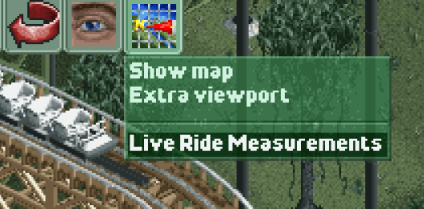
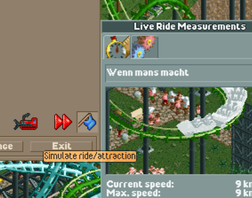

# Live Ride Measurements - OpenRCT2 Plugin 🎢

An OpenRCT2 Plugin which shows ride measurements. Can be useful when constructing a ride. 

---


---

## Installing

1. Download the latest release from [here](https://github.com/Phelicks/openrct2-live-ride-measurements/releases/latest).
2. Put the `.js` file in your OpenRCT2 Plugin folder:
    - Windows: C:\Users\YourName\Documents\OpenRCT2
    - Mac: /Users/YourName/Library/Application Support/OpenRCT2
    - Linux: $XDG_CONFIG_HOME/OpenRCT2 or in its absence $HOME/.config/OpenRCT2
3. Start OpenRCT2.

## How to use
1. Load your scenario.
2. Open the `Live Ride Measurements` windows by clicking and holding the map icon.

3. Select your ride in the opened window.
4. If you're still constructing the roller coaster, enable ghost trains by clicking the blue flag in the construction menu.


Please be aware that at this moment the plug-in only supports rides with a single station.


## Building the plugin
Setup:
```
npm install
```

then run:
```
npm run build
```
The plugin file can then be found in the `release` folder.

For development you can use:
```
npm run watch 
```
Be aware that you still need to copy the plugin manually in your OpenRXT2 plugin folder.